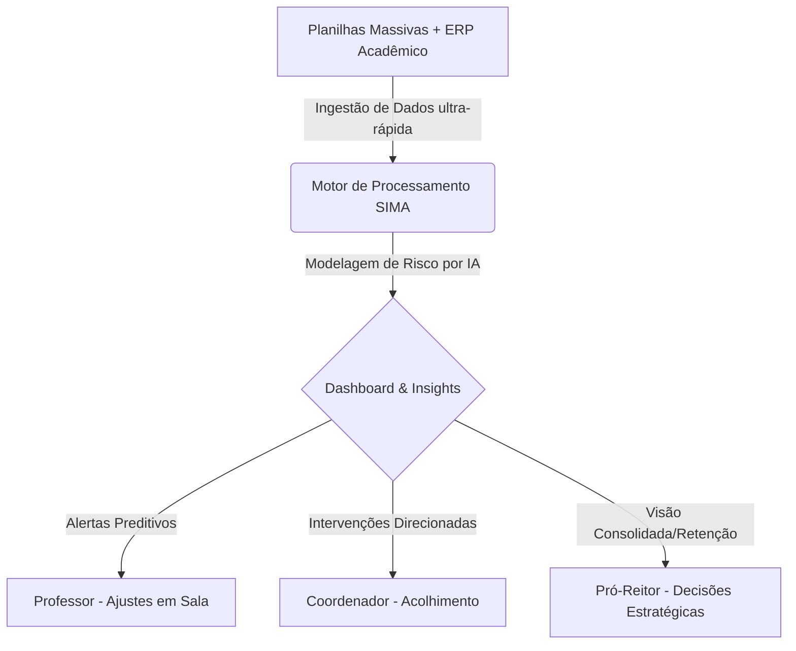
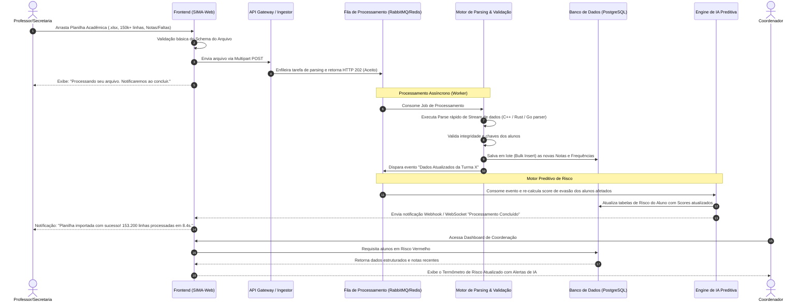
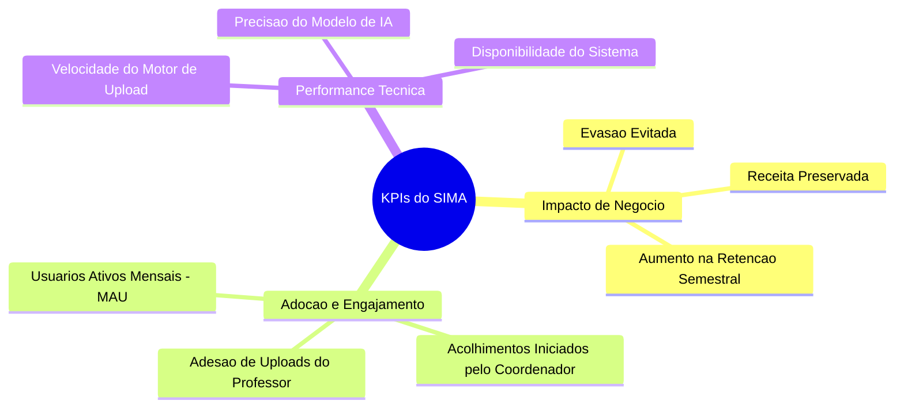

# SIMA — Sistema Inteligente de Monitoramento Acadêmico
## Documento de Especificação de Produto (PRD — Product Requirement Document)

| Informações do Documento | Detalhes |
| :--- | :--- |
| **Status** | Aprovado para Desenvolvimento |
| **Versão** | v1.0.0 |
| **Autor** | ProductManagerDoc (Diretor de Produto) |
| **Público-Alvo** | Engenharia, Design, Operações, Stakeholders Executivos |
| **Data de Criação** | 25 de Maio de 2026 |

---

## 1. Visão de Produto e Proposta de Valor

### 1.1 O que é o SIMA?
O **SIMA (Sistema Inteligente de Monitoramento Acadêmico)** é uma plataforma enterprise de Inteligência de Dados e Análise Preditiva desenhada especificamente para Instituições de Ensino Superior (IES) e redes educacionais de grande porte. O sistema atua como uma camada de inteligência integrada que consolida dados de notas, frequência, engajamento e comportamento estudantil para prever riscos de evasão e baixo desempenho acadêmico antes que estes se tornem irreversíveis.

### 1.2 Dores de Mercado Resolvidas
* **Evasão Silenciosa:** Instituições frequentemente só descobrem que um aluno evadiu quando ele deixa de renovar a matrícula ou acumula faltas ao ponto de reprovação automática. O SIMA transforma a abordagem reativa em proativa.
* **Dados Desconexos e Silados:** Notas ficam retidas em planilhas locais dos professores ou em módulos legados do Sistema de Informações Acadêmicas (SIA/ERP). Frequências são registradas de forma assíncrona. O SIMA unifica esses fluxos em um motor de processamento massivo e centralizado.
* **Sobrecarga de Trabalho dos Coordenadores:** Coordenadores de curso gastam mais de 70% do tempo cruzando dados manualmente no Excel para identificar alunos em risco, sobrando pouco tempo para ações de acolhimento pedagógico e mentoria.
* **Falta de Previsibilidade Estratégica para a Reitoria:** Pró-Reitores e Gestores Acadêmicos carecem de dashboards em tempo real que correlacionem políticas pedagógicas com retenção financeira e eficiência operacional.

### 1.3 Proposta de Valor Única (UVP)
> *"Prever a evasão para acolher a tempo. O SIMA transforma dados acadêmicos dispersos em intervenções pedagógicas automatizadas e personalizadas por meio de Inteligência Artificial Preditiva de última milha."*

### 1.4 Objetivos de Negócio
1. **Redução da Evasão Acadêmica:** Diminuir a taxa de evasão institucional em até 15% nos primeiros 12 meses de implantação completa.
2. **Aumento do NPS do Aluno:** Melhorar a percepção de suporte e acolhimento pedagógico da instituição em 20 pontos através de intervenções precisas e humanizadas.
3. **Eficiência Operacional:** Otimizar o tempo de identificação de alunos em risco de semanas para frações de segundos após a consolidação dos dados.
4. **Engajamento Docente:** Alcançar uma taxa de adoção superior a 85% entre os professores na utilização diária da plataforma para upload e acompanhamento de turmas.

---

## 2. Persona Ideal (ICP - Ideal Customer Profile)

O SIMA foi estruturado para atender a instituições de ensino que se enquadram no seguinte perfil ideal:

* **Tipo de Instituição:** Grupos Educacionais de Médio e Grande Porte (pluri-campi), Universidades, Centros Universitários e Faculdades Isoladas com mais de 5.000 alunos ativos.
* **Maturidade Tecnológica:** Nível Médio a Avançado. Possuem sistemas legados de ERP acadêmico (ex.: TOTVS Educacional, Sophia, Canvas, Moodle, Lyceum), mas sofrem com a falta de inteligência preditiva integrada sobre esses dados.
* **Modelo de Ensino:** Híbrido, Presencial e EAD (Ensino a Distância).
* **Estrutura de Gestão:** Possuem uma pró-reitoria acadêmica estruturada ou direção de operações, coordenação de cursos atuante e um time (mesmo que enxuto) de retenção de alunos/sucesso do cliente.

---

## 3. Personas de Usuários Detalhadas

Para garantir que a experiência do produto atenda com excelência às necessidades reais da ponta, desenhamos três personas principais representativas do nosso ecossistema educacional.

### 3.1 Persona 1: O Professor (O Executor e Sensor Primário)
* **Nome Fictício:** Dr. Roberto Martins (45 anos)
* **Papel:** Professor Adjunto do curso de Engenharia de Software e Banco de Dados.
* **Maturidade Digital:** Intermediária. Usa computadores no dia a dia, mas prefere ferramentas simples e diretas. Detesta interfaces confusas que tomam seu tempo de preparação de aulas.

#### Dores e Frustrações:
* Gastar tempo excessivo digitando notas e frequências em múltiplos portais acadêmicos lentos.
* Não ter visibilidade se suas metodologias de ensino estão funcionando de forma homogênea na turma até que o semestre acabe.
* Sentir-se culpado quando um aluno brilhante desaparece das aulas e ele só percebe tarde demais para ajudar.

#### Necessidades Críticas:
* Um método ultra-rápido para enviar as avaliações de suas turmas (upload em lote via planilhas de notas e frequências).
* Visualização visual imediata de alunos que despencaram de rendimento em sua disciplina específica.
* Sugestões práticas de como ajudar a turma com dificuldades em tópicos específicos.

#### Objetivos no SIMA:
* Cumprir seus prazos burocráticos de lançamento de notas em segundos.
* Identificar quais alunos precisam de monitoria ou revisão de conteúdo na próxima semana.

#### Jornada no SIMA:
1. **Acesso Simplificado:** Roberto faz login integrado via Single Sign-On (SSO) institucional.
2. **Upload Massivo:** Arrasta a planilha de notas exportada do seu ambiente de correção para o SIMA. O sistema valida em 2 segundos e atualiza o status.
3. **Leitura de Alertas:** Recebe um card de recomendação: *"3 alunos da Turma A apresentaram queda abrupta na Nota 2 comparado à Nota 1. Recomendado indicar para o programa de nivelamento de Algoritmos."*
4. **Ação:** Roberto clica em um botão e envia um convite para monitoria diretamente aos alunos identificados.

---

### 3.2 Persona 2: O Coordenador de Curso (O Articulador e Gestor Tático)
* **Nome Fictício:** Profª. Marina Albuquerque (38 anos)
* **Papel:** Coordenadora dos Cursos de Administração e Ciências Contábeis.
* **Maturidade Digital:** Alta. Excelente usuária de planilhas dinâmicas de Excel, ávida consumidora de relatórios de desempenho e focada em metas de retenção.

#### Dores e Frustrações:
* Cobrar professores constantemente para manterem os diários de classe atualizados.
* Passar finais de semana cruzando relatórios de frequência de 400 alunos no Excel para achar quem faltou mais de 25% das aulas.
* Ser cobrada pela diretoria pelo indicador de evasão do curso sem ter ferramentas em tempo real para agir preventivamente.

#### Necessidades Críticas:
* Painel centralizador (Dashboard) que mostre o "Termômetro de Risco" de todo o seu curso.
* Alertas preditivos em tempo real que segmentem os alunos por faixas de risco (Verde, Amarelo, Vermelho).
* Histórico centralizado de contatos e planos de ação pedagógica aplicados a cada aluno em risco.

#### Objetivos no SIMA:
* Reduzir a taxa de evasão do curso de Administração de 12% para menos de 6% no semestre.
* Ter reuniões de acolhimento altamente produtivas e baseadas em dados consolidados de múltiplos professores.

#### Jornada no SIMA:
1. **Abertura do Dia:** Marina abre o SIMA e visualiza a saúde geral do curso no Dashboard principal.
2. **Triagem de Alertas:** O sistema destaca 15 alunos que entraram na "Zona de Risco Vermelha" (alta probabilidade de abandono devido à correlação de notas baixas e faltas consecutivas).
3. **Diagnóstico por IA:** Ao clicar no perfil de um aluno, a IA do SIMA resume os fatores: *"Faltas consecutivas nas últimas 3 semanas + Desempenho acadêmico abaixo da média do curso em disciplinas quantitativas."*
4. **Execução:** Marina clica em "Iniciar Acolhimento", gerando uma tarefa integrada de contato telefônico ou agendamento de reunião pedagógica no CRM da instituição.

---

### 3.3 Persona 3: O Pró-Reitor / Gestor Acadêmico (O Decisor Estratégico)
* **Nome Fictício:** Dr. Henrique D'Ávila (54 anos)
* **Papel:** Pró-Reitor Acadêmico e Diretor de Operações de Grupo Educacional.
* **Maturidade Digital:** Focada em Negócios. Prefere relatórios executivos de alto nível, gráficos de tendências financeiras, impacto em ROI e projeções macro.

#### Dores e Frustrações:
* Falta de previsibilidade de receita devido à perda não planejada de mensalidades ao longo do semestre.
* Dificuldade em avaliar se os investimentos em novos laboratórios, programas de bolsas ou nivelamento de alunos estão realmente gerando impacto na retenção acadêmica.
* Receber dados consolidados de evasão apenas 3 meses após o encerramento do período letivo, impossibilitando qualquer ação corretiva tempestiva.

#### Necessidades Críticas:
* Visão macro (Nível de Grupo, Campus, Curso e Turno) da saúde de retenção acadêmica.
* Relação direta estimada em R$ (Reais) de receita preservada a partir de alunos retirados da zona de evasão.
* Relatórios consolidados exportáveis e prontos para apresentação em Conselhos de Administração.

#### Objetivos no SIMA:
* Manter o EBITDA do grupo sob controle através da redução sistemática do Churn (evasão).
* Distribuir recursos humanos e financeiros de apoio acadêmico para as unidades com maior criticidade de evasão.

#### Jornada no SIMA:
1. **Reunião de Diretoria:** Henrique projeta o painel Executivo do SIMA na tela principal.
2. **Análise de Tendência:** Observa que a unidade Centro reduziu a evasão projetada em 8% após a adoção dos alertas do SIMA pelos professores de ciclo básico.
3. **Análise Financeira:** Visualiza a métrica de "Receita Salva Projetada" na tela de ROI do SIMA, constatando economia direta de R$ 320.000,00 em mensalidades preservadas naquele semestre.
4. **Tomada de Decisão:** Aprova a expansão da ferramenta SIMA para mais duas faculdades recém-adquiridas pelo grupo baseado nos números irrefutáveis demonstrados na tela.

---

## 4. Matriz de Funcionalidades (Product Feature Matrix) & Priorização

Para garantir um lançamento consistente e focado em resolver as dores mais imediatas sem sacrificar a escalabilidade técnica, utilizamos a metodologia de priorização **MoSCoW** integrada a uma avaliação simplificada de **RICE (Reach, Impact, Confidence, Effort)**.

### Tabela Geral de Funcionalidades

| ID | Funcionalidade | Descrição Técnica | Fase | Prioridade (MoSCoW) | Impacto / Esforço |
| :--- | :--- | :--- | :---: | :---: | :---: |
| **FN-01** | Motor de Processamento Massivo | Importação e validação de arquivos Excel/CSV gigantes (150k+ linhas) com parsing ultra-rápido de dados acadêmicos. | 1 | **Must Have** | Alto / Médio |
| **FN-02** | Painel do Coordenador | Dashboard tático com o "Termômetro de Risco" consolidando alunos em faixas de criticidade. | 1 | **Must Have** | Alto / Baixo |
| **FN-03** | Painel do Professor | Interface enxuta para upload rápido de planilhas de notas e listagem de alertas rápidos de turmas. | 1 | **Must Have** | Alto / Baixo |
| **FN-04** | IA Preditiva Base | Modelo estatístico/Machine Learning supervisionado básico para pontuar o score de risco do aluno (0 a 100). | 1 | **Must Have** | Alto / Médio |
| **FN-05** | Painel Executivo | Dashboard estratégico para Pró-Reitores com visão macro de ROI, Churn e saúde de campus. | 1 | **Must Have** | Alto / Médio |
| **FN-06** | LGPD e Auditoria | Registro completo de logs de acesso aos dados acadêmicos, controle de permissões por nível (RBAC) e termos de consentimento. | 1 | **Must Have** | Crítico / Médio |
| **FN-07** | Alertas Automatizados | Envio de e-mail/notificação automática para o coordenador quando um aluno entra na zona vermelha de risco. | 2 | **Should Have** | Médio / Baixo |
| **FN-08** | IA Generativa de Insights | Integração com LLM (Large Language Model) para gerar relatórios detalhados contendo a justificativa do risco e plano de ação sugerido. | 2 | **Should Have** | Alto / Alto |
| **FN-09** | Integração via API (ERP) | Sincronização automatizada bi-direcional em tempo real com TOTVS, Canvas, Moodle e outros grandes players. | 2 | **Should Have** | Alto / Alto |
| **FN-10** | Portal de Acolhimento | Área compartilhada de anotações pedagógicas onde o coordenador registra a evolução das conversas com o aluno em risco. | 2 | **Should Have** | Médio / Baixo |
| **FN-11** | App Mobile Aluno/Prof | Aplicativo nativo ou PWA focado em notificações push, lembretes de monitoria e agendamentos pedagógicos. | 3 | **Could Have** | Baixo / Alto |
| **FN-12** | Recomendação de Trilhas | IA recomendando conteúdos de reforço acadêmico de forma personalizada com base nos gaps de nota de cada aluno. | 3 | **Could Have** | Médio / Alto |
| **FN-13** | Gamificação Docente | Sistema de recompensas e badges para engajar os professores a manterem os dados sempre atualizados antes do prazo. | 3 | **Won't Have** | Baixo / Médio |

---

## 5. Mapeamento da Jornada do Usuário (User Journey Mapping)

Abaixo, detalhamos o fluxo operacional crítico do SIMA: a entrada massiva de dados por planilhas, o processamento inteligente em background e a geração de insights acionáveis na ponta pedagógica.

### 5.1 O Processo de Ingestão de Dados (Explicação Detalhada do Fluxo)

1. **Upload e Resiliência:** O usuário arrasta o arquivo para a área de upload. O frontend do SIMA verifica a extensão e o cabeçalho básico do arquivo localmente em menos de 100ms. Se o arquivo estiver corrompido ou fora das colunas padrão, o upload é abortado imediatamente com feedback claro para o usuário.
2. **Processamento em Segundo Plano (Background Job):** Para arquivos gigantes (+150k de linhas), o SIMA adota uma arquitetura assíncrona orientada a eventos. O arquivo é enviado diretamente para um bucket seguro (S3 ou similar) e uma tarefa de processamento é enfileirada em um sistema de mensageria de alta performance (ex.: Redis Streams ou RabbitMQ). Isso garante que o servidor web nunca trave ou dê timeout na conexão do usuário.
3. **Processador por Fluxo (Streaming Parser):** O Worker que executa o processamento do arquivo abre um stream de leitura de dados diretamente, em vez de carregar todas as 150.000 linhas na memória RAM simultaneamente. Isso previne estouro de memória (Out Of Memory - OOM) e permite que a validação lógica seja extremamente veloz.
4. **Alimentação Preditiva e Cálculo de Riscos:** O motor de processamento salva os dados consolidados no banco de dados e avisa o serviço de IA. Este serviço avalia o histórico acadêmico anterior daquele aluno, frequência agregada recente, comportamento da turma, desvio padrão e, por meio de inteligência artificial supervisionada, recalcula a "Probabilidade de Abandono". Se o risco ultrapassar 75%, o aluno é marcado com a bandeira vermelha.

---

## 6. Requisitos Não-Funcionais Críticos (RNF)

Os requisitos não-funcionais definem a robustez técnica, os pilares de segurança e a velocidade de resposta do SIMA, alinhando a solução aos padrões enterprise exigidos em grandes corporações.

### 6.1 Performance e Eficiência Operacional
* **RNF-01: Tempo Limite de Processamento Massivo:** O sistema deve ser capaz de receber, ler, validar, processar e registrar no banco de dados um arquivo de notas e frequências estruturado de **150.000 linhas em no máximo 15 segundos**, do início do upload até a notificação final de sucesso para o usuário.
* **RNF-02: Tempo de Carregamento de Dashboards:** O tempo de renderização de relatórios do painel da Coordenação de Curso contendo dados de até 10.000 alunos deve ser menor que **2 segundos** sob condições normais de rede.
* **RNF-03: Concorrência Simultânea:** A API do SIMA deve suportar picos de concorrência de até **1.500 professores fazendo uploads simultâneos** de planilhas sem degradação do tempo de resposta geral do portal (escalabilidade horizontal dinâmica através de Kubernetes).

### 6.2 Segurança, Privacidade e Conformidade (LGPD)
> [!IMPORTANT]
> O SIMA lida diretamente com dados acadêmicos e pessoais de menores ou adultos em vulnerabilidade de aprendizado. A estrita conformidade com a LGPD (Lei Geral de Proteção de Dados - Lei 13.709/2018) é pré-requisito obrigatório de arquitetura.

* **RNF-04: Criptografia de Dados:** Todos os dados pessoais identificáveis (PII) dos alunos, como CPF, E-mail, Telefone e Matrícula, devem ser criptografados em repouso (AES-256) e todas as comunicações da plataforma devem ocorrer via canais TLS 1.3 (em trânsito).
* **RNF-05: Controle de Acesso Baseado em Perfis (RBAC):**
  * **Professores** só visualizam dados acadêmicos de alunos matriculados em suas disciplinas específicas.
  * **Coordenadores de Curso** visualizam dados das turmas e alunos pertencentes aos cursos que administram.
  * **Pró-Reitores e Gestores Globais** possuem acesso a dados agregados de performance de campus e dados anônimos para fins financeiros, apenas abrindo informações individuais mediante justificativa registrada de auditoria.
* **RNF-06: Direito ao Esquecimento e Anonimização:** O SIMA deve possuir uma rotina automatizada para expurgar dados pessoais ou anonimizar registros acadêmicos de ex-alunos após o prazo legal exigido pelo Ministério da Educação (MEC), mantendo apenas as estatísticas agregadas sem identificadores diretos.
* **RNF-07: Logs de Auditoria Imutáveis:** Toda e qualquer alteração de dados, acessos a perfis de alunos em risco e downloads de relatórios devem ser registrados em uma trilha de auditoria (audit log) imutável e à prova de adulteração, para fins de compliance de segurança de dados.

### 6.3 Escalabilidade, Disponibilidade e Resiliência
* **RNF-08: SLA de Disponibilidade:** O SIMA deve operar com uma disponibilidade mensal garantida de **99,9% (Uptime)**, utilizando arquiteturas multi-zona de nuvem para redundância.
* **RNF-09: Isolamento de Falhas (Circuit Breaker):** Caso o módulo preditivo de IA ou a ferramenta de geração de relatórios de IA Generativa fiquem indisponíveis por sobrecarga externa, as funcionalidades básicas de login, upload de planilhas e visualização de tabelas padrão de notas não podem ser interrompidas.
* **RNF-10: Backup e Disaster Recovery (RPO/RTO):**
  * **RPO (Recovery Point Objective):** Máximo de 1 hora de perda de dados. Backups automáticos incrementais de banco de dados devem ocorrer a cada 60 minutos.
  * **RTO (Recovery Time Objective):** Em caso de desastre catastrófico no cluster principal, o tempo máximo de restabelecimento total da operação deve ser de até **2 horas**.

---

## 7. Métricas de Sucesso e KPIs de Produto

Para medir a eficácia e o retorno sobre o investimento (ROI) da implementação do SIMA em uma IES parceira, acompanhamos métricas divididas em três frentes de valor.

### 7.1 KPIs de Impacto de Negócio
1. **Taxa de Evasão Acadêmica Evitada:** Diferença percentual na taxa de evasão de alunos após a implantação do SIMA em relação à média histórica do mesmo curso. (Alvo: Redução de 10% a 15% na evasão global).
2. **Receita Mensal Preservada (R$):** Valor total em mensalidades escolares salvas diretamente ligadas a alunos classificados in "Risco Amarelo ou Vermelho" que passaram por plano de intervenção pedagógica do SIMA e renovaram a matrícula ou permaneceram ativos.
3. **Eficácia de Intervenção Pedagógica:** Percentual de alunos que estavam na zona de risco (Score > 75) e retornaram para a zona segura (Score < 40) após a aplicação de uma ação documentada pelo coordenador. (Alvo: Mínimo de 60% de sucesso nas intervenções).

### 7.2 KPIs de Adoção e Engajamento de Produto
1. **Taxa de Adesão Docente (Upload Compliance):** Percentual de professores que realizaram o upload de notas e faltas no SIMA até o 5º dia útil após o encerramento do módulo de avaliações. (Alvo: > 90%).
2. **Tempo Médio de Acolhimento (TMA):** Tempo médio decorrido entre o sistema alertar "Risco Vermelho" para um aluno e o coordenador de curso iniciar o processo de acolhimento pedagógico no SIMA. (Alvo: < 48 horas úteis).
3. **MAU / WAU (Monthly/Weekly Active Users):** Frequência de acesso dos coordenadores e gestores aos relatórios analíticos da plataforma. (Alvo: Acesso de coordenadores ao menos 3 vezes por semana).

### 7.3 KPIs de Performance e Eficácia Tecnológica
1. **Acurácia Preditiva (Precision & Recall):** A precisão do modelo de IA do SIMA ao indicar um risco de evasão que se confirma na realidade (sem intervenções) versus a taxa de falsos positivos gerados. (Alvo: Precisão superior a 88% do modelo preditivo).
2. **Tempo Médio de Parsing Massivo:** Tempo médio necessário para que o motor processe e valide as planilhas dos professores. (Alvo: Média de 8 segundos para 150k+ linhas).

---

## 8. Considerações Finais de Lançamento (Release Strategy)

O sucesso da adoção do SIMA depende diretamente da facilidade de uso na ponta. Portanto, o lançamento da Fase 1 (MVP) focará exclusivamente na estabilidade do motor de upload e na simplicidade da interface do Professor e Coordenador. 

A introdução dos modelos preditivos mais avançados de IA e conexões automatizadas de ERP (Fase 2) será realizada de forma gradual, permitindo que a base de dados do SIMA se consolide nos primeiros meses de operação de forma estruturada, segura e em total harmonia com os regulamentos de segurança de dados (LGPD) e processos acadêmicos de excelência de nossas instituições parceiras.
